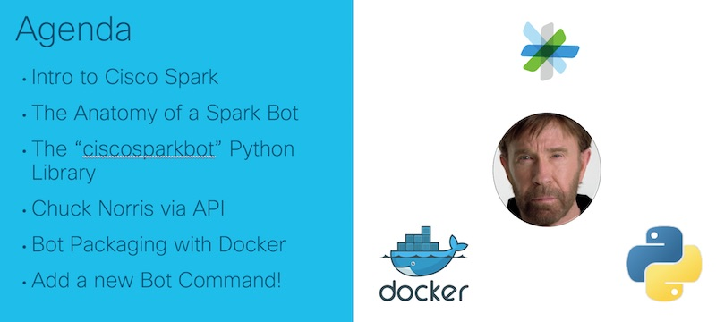

# Build a Chat Bot with Chuck Norris, Python and Docker

Code and resources for coding tutorial **Build a Chat Bot with Chuck Norris, Python and Docker:** *Have a little fun while we learn about Spark Bot creation*. 

### Abstract
Can a Chuck Norris Bot deliver a roundhouse kick? Find out in this session where we build a Chuck Norris joke telling Chat Bot! We'll write our bot using Python and package it up as a Docker image to make it portable. Along the way you'll learn about Webhooks and their importance in cloud applications, Micro-Services and the Cisco Spark Collaboration Cloud, all skills you can then use to build your own Bots to accomplish any task you can think of! This session is designed to be fun and hands on, so make sure to bring your laptop, sense of humor and great questions! 

## Prerequisites 

To complete this lab you'll need to have a few things done in advance.  

### Development workstation (ie laptop)

Lab can be completed on Mac, Linux, or Windows platform as long as the following are installed and available.  

* Python 3.6
  * [www.python.org/downloads](https://www.python.org/downloads/)
  * *Python 3.x would likely work, but sample code tested with 3.6*
  * *Python 2.7 would work with slight code modifications*
* Docker for X 
  * [www.docker.com/get-docker](https://www.docker.com/get-docker) 
* ngrok – Local Secure Tunnels
  * [ngrok.com/download](https://ngrok.com/download) 
* git
  * [git-scm.com/downloads](https://git-scm.com/downloads)
  * *Not absolutely required, but highly recommended*
### Accounts

To complete this lab you'll need an account with Cisco Spark.  Any account type from free to enterprise will work for this lab.  

* Cisco Spark 
  * [web.ciscospark.com](https://web.ciscospark.com)
